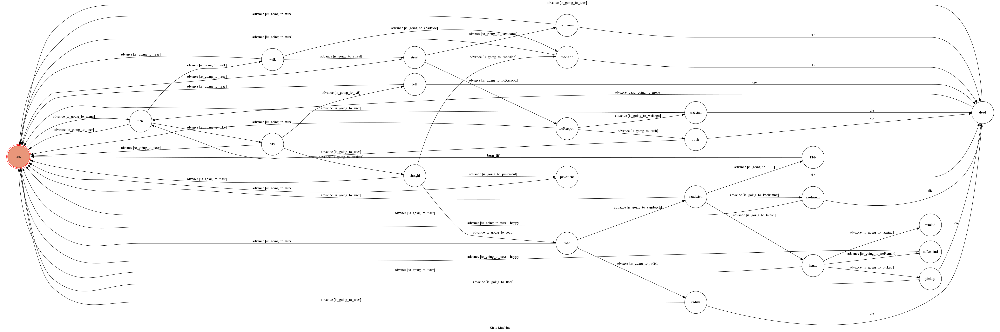

# Tainan Simulator

A Line bot based on a finite state machine. 
Let you experience every shitty day in Tainan 

## Deploy
deploy webhooks on AWS EC2.

## Finite State Machine

## Usage

You can click a button in every state.
The initial state is user.

- ### user
    - **Title:** 開啟你的旅程
	- **Input:** 【Start】【No Start】
- ### menu
    - **Title:** 早上起床，發現快遲到了
    - **Input:** 【走路】【機車】【腳踏車】
- ### walk
    - **Title:** 健康的走路，該走哪條呢?
	- **Input:** 【路緣】 【騎樓】 【人行道】
- ### roadside
    - **Title:** 突然有卡車切進去，在台南還敢走路緣啊，人生登出
	- **Input:** 【give up】 【restart】
- ### street
    - **Title:** 此時路過市集，突然有女生大喊「帥哥」\~~
	- **Input:** 【帥爆 回頭】 【不理她】
- ### handsome
    - **Title:** 近女色 失敗", "結果只是個大媽叫你, 被她纏上導致遲到
	- **Input:** 【give up】 【restart】
- ### noRespon
    - **Title:** 到了馬路口，遇到紅燈，看起來四周無車
	- **Input:** 【等紅燈】 【衝過去】
- ### waitsign
    - **Title:** 小孩子才走路, 乖乖等紅燈，但已經遲到了
	- **Input:** 【give up】 【restart】
- ### rush
    - **Title:** 加速跑過去，結果就撞車了，在台南還敢闖紅燈啊
	- **Input:** 【give up】 【restart】
- ### straight
    - **Title:** 騎對了方向，再選條路吧~
	- **Input:** 【馬路】 【騎樓】 【路緣】
- ### left
    - **Title:** 迷路啦，乖乖遲到吧
	- **Input:** 【give up】 【restart】
- ### road
    - **Title:** 騎一騎肚子餓了，騎到早餐店，買什麼早餐?
	- **Input:** 【現成的三明治】 【現煎的蘿蔔糕】 【現成的蛋餅】
- ### pavement
    - **Title:** 台南的騎樓怎麼可能是空的呢，早就推滿東西啦
	- **Input:** 【give up】 【restart】
- ### sandwich
    - **Title:** 買完離開早餐店，終於快到系館了，遭遇了紅燈
	- **Input:** 【等紅燈】 【高雄式左轉】 【台南式右轉】 【怒燒】
- ### radish
    - **Title:** 這裡可是台南欸!，直接撞上另一台橫向跨越馬路的車
	- **Input:** 【give up】 【restart】
- ### kaohsiung
    - **Title:** 健康的走路，該走哪條呢?
	- **Input:** 【give up】 【restart】
- ### FFF
    - **Title:** 成功消滅一對情侶!
	- **Input:** 【走路】 【機車】 【腳踏車】
- ### tainan
    - **Title:** 到了地停前，發現旁邊的正妹東西掉了，你應該?
	- **Input:** 【提醒他】 【撿走】 【不理她】
- ### remind
    - **Title:** Happy End，雖然遲到了，但得到了正妹的line
	- **Input:** 【Start】 【No Start】
- ### pickup
    - **Title:** 私藏時被抓包，警察局見
	- **Input:** 【Start】 【No Start】
- ### noRemind
    - **Title:** True End，準時抵達教室，上課囉
	- **Input:** 【Start】 【No Start】

